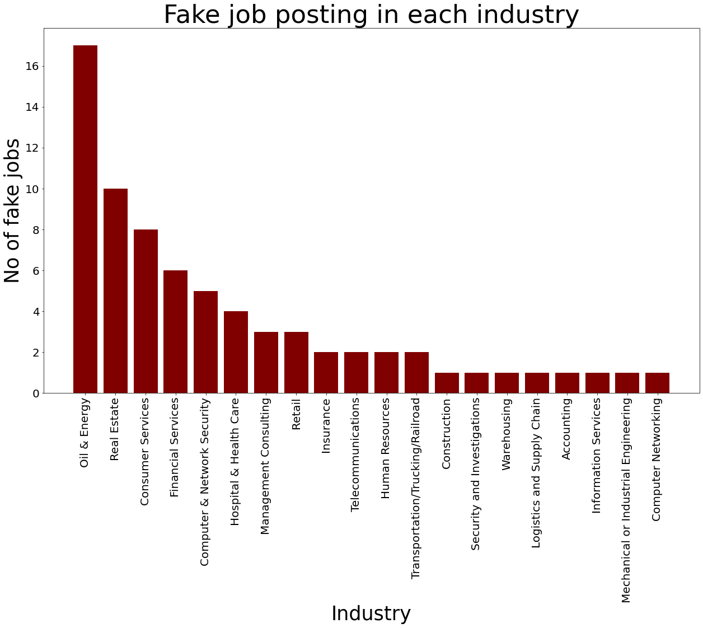

```python
# Python 3 environment comes with many helpful analytic libraries installed
# For example, here are some useful libraries for this project.
import numpy as np # Linear algebra
import pandas as pd # Data processing
import matplotlib.pyplot as plt # Data visualization
```


```python
import pandas as pd
import numpy as np
import matplotlib.pyplot as plt
```


```python
url='https://raw.githubusercontent.com/she-code-africa/SCAMP-Cohort6-Technical-Assessment/master/intermediate/fake_job_postings.csv'
```


```python
df=pd. read_csv(url)
```


```python
df. head()
```


<div>
<style scoped>
    .dataframe tbody tr th:only-of-type {
        vertical-align: middle;
    }

    .dataframe tbody tr th {
        vertical-align: top;
    }

    .dataframe thead th {
        text-align: right;
    }
</style>
<table border="1" class="dataframe">
  <thead>
    <tr style="text-align: right;">
      <th></th>
      <th>job_id</th>
      <th>title</th>
      <th>location</th>
      <th>department</th>
      <th>salary_range</th>
      <th>company_profile</th>
      <th>description</th>
      <th>requirements</th>
      <th>benefits</th>
      <th>telecommuting</th>
      <th>has_company_logo</th>
      <th>has_questions</th>
      <th>employment_type</th>
      <th>required_experience</th>
      <th>required_education</th>
      <th>industry</th>
      <th>function</th>
      <th>fraudulent</th>
    </tr>
  </thead>
  <tbody>
    <tr>
      <th>0</th>
      <td>1</td>
      <td>Marketing Intern</td>
      <td>US, NY, New York</td>
      <td>Marketing</td>
      <td>NaN</td>
      <td>We're Food52, and we've created a groundbreaki...</td>
      <td>Food52, a fast-growing, James Beard Award-winn...</td>
      <td>Experience with content management systems a m...</td>
      <td>NaN</td>
      <td>0</td>
      <td>1</td>
      <td>0</td>
      <td>Other</td>
      <td>Internship</td>
      <td>NaN</td>
      <td>NaN</td>
      <td>Marketing</td>
      <td>0</td>
    </tr>
    <tr>
      <th>1</th>
      <td>2</td>
      <td>Customer Service - Cloud Video Production</td>
      <td>NZ, , Auckland</td>
      <td>Success</td>
      <td>NaN</td>
      <td>90 Seconds, the worlds Cloud Video Production ...</td>
      <td>Organised - Focused - Vibrant - Awesome!Do you...</td>
      <td>What we expect from you:Your key responsibilit...</td>
      <td>What you will get from usThrough being part of...</td>
      <td>0</td>
      <td>1</td>
      <td>0</td>
      <td>Full-time</td>
      <td>Not Applicable</td>
      <td>NaN</td>
      <td>Marketing and Advertising</td>
      <td>Customer Service</td>
      <td>0</td>
    </tr>
    <tr>
      <th>2</th>
      <td>3</td>
      <td>Commissioning Machinery Assistant (CMA)</td>
      <td>US, IA, Wever</td>
      <td>NaN</td>
      <td>NaN</td>
      <td>Valor Services provides Workforce Solutions th...</td>
      <td>Our client, located in Houston, is actively se...</td>
      <td>Implement pre-commissioning and commissioning ...</td>
      <td>NaN</td>
      <td>0</td>
      <td>1</td>
      <td>0</td>
      <td>NaN</td>
      <td>NaN</td>
      <td>NaN</td>
      <td>NaN</td>
      <td>NaN</td>
      <td>0</td>
    </tr>
    <tr>
      <th>3</th>
      <td>4</td>
      <td>Account Executive - Washington DC</td>
      <td>US, DC, Washington</td>
      <td>Sales</td>
      <td>NaN</td>
      <td>Our passion for improving quality of life thro...</td>
      <td>THE COMPANY: ESRI – Environmental Systems Rese...</td>
      <td>EDUCATION: Bachelor’s or Master’s in GIS, busi...</td>
      <td>Our culture is anything but corporate—we have ...</td>
      <td>0</td>
      <td>1</td>
      <td>0</td>
      <td>Full-time</td>
      <td>Mid-Senior level</td>
      <td>Bachelor's Degree</td>
      <td>Computer Software</td>
      <td>Sales</td>
      <td>0</td>
    </tr>
    <tr>
      <th>4</th>
      <td>5</td>
      <td>Bill Review Manager</td>
      <td>US, FL, Fort Worth</td>
      <td>NaN</td>
      <td>NaN</td>
      <td>SpotSource Solutions LLC is a Global Human Cap...</td>
      <td>JOB TITLE: Itemization Review ManagerLOCATION:...</td>
      <td>QUALIFICATIONS:RN license in the State of Texa...</td>
      <td>Full Benefits Offered</td>
      <td>0</td>
      <td>1</td>
      <td>1</td>
      <td>Full-time</td>
      <td>Mid-Senior level</td>
      <td>Bachelor's Degree</td>
      <td>Hospital &amp; Health Care</td>
      <td>Health Care Provider</td>
      <td>0</td>
    </tr>
  </tbody>
</table>
</div>


```python
# Info  is about the shape of the data and the type of individual columns
df.info()
```

    <class 'pandas.core.frame.DataFrame'>
    RangeIndex: 17880 entries, 0 to 17879
    Data columns (total 18 columns):
     #   Column               Non-Null Count  Dtype 
    ---  ------               --------------  ----- 
     0   job_id               17880 non-null  int64 
     1   title                17880 non-null  object
     2   location             17534 non-null  object
     3   department           6333 non-null   object
     4   salary_range         2868 non-null   object
     5   company_profile      14572 non-null  object
     6   description          17879 non-null  object
     7   requirements         15185 non-null  object
     8   benefits             10670 non-null  object
     9   telecommuting        17880 non-null  int64 
     10  has_company_logo     17880 non-null  int64 
     11  has_questions        17880 non-null  int64 
     12  employment_type      14409 non-null  object
     13  required_experience  10830 non-null  object
     14  required_education   9775 non-null   object
     15  industry             12977 non-null  object
     16  function             11425 non-null  object
     17  fraudulent           17880 non-null  int64 
    dtypes: int64(5), object(13)
    memory usage: 2.5+ MB
    


```python
# Check for number of null values
df.isna().sum()
```


    job_id                     0
    title                      0
    location                 346
    department             11547
    salary_range           15012
    company_profile         3308
    description                1
    requirements            2695
    benefits                7210
    telecommuting              0
    has_company_logo           0
    has_questions              0
    employment_type         3471
    required_experience     7050
    required_education      8105
    industry                4903
    function                6455
    fraudulent                 0
    dtype: int64


```python
# Check for any dublicate row in the data
df.duplicated().sum()
```


    0


```python
# Remove rows with null values
df.dropna( axis = 0, how = "any", inplace = True )
```


```python
df.isna().sum()
```


    job_id                 0
    title                  0
    location               0
    department             0
    salary_range           0
    company_profile        0
    description            0
    requirements           0
    benefits               0
    telecommuting          0
    has_company_logo       0
    has_questions          0
    employment_type        0
    required_experience    0
    required_education     0
    industry               0
    function               0
    fraudulent             0
    dtype: int64


```python
df.columns
```


    Index(['job_id', 'title', 'location', 'department', 'salary_range',
           'company_profile', 'description', 'requirements', 'benefits',
           'telecommuting', 'has_company_logo', 'has_questions', 'employment_type',
           'required_experience', 'required_education', 'industry', 'function',
           'fraudulent'],
          dtype='object')


```python
df.head()
```


<div>
<style scoped>
    .dataframe tbody tr th:only-of-type {
        vertical-align: middle;
    }

    .dataframe tbody tr th {
        vertical-align: top;
    }

    .dataframe thead th {
        text-align: right;
    }
</style>
<table border="1" class="dataframe">
  <thead>
    <tr style="text-align: right;">
      <th></th>
      <th>job_id</th>
      <th>title</th>
      <th>location</th>
      <th>department</th>
      <th>salary_range</th>
      <th>company_profile</th>
      <th>description</th>
      <th>requirements</th>
      <th>benefits</th>
      <th>telecommuting</th>
      <th>has_company_logo</th>
      <th>has_questions</th>
      <th>employment_type</th>
      <th>required_experience</th>
      <th>required_education</th>
      <th>industry</th>
      <th>function</th>
      <th>fraudulent</th>
    </tr>
  </thead>
  <tbody>
    <tr>
      <th>6</th>
      <td>7</td>
      <td>Head of Content (m/f)</td>
      <td>DE, BE, Berlin</td>
      <td>ANDROIDPIT</td>
      <td>20000-28000</td>
      <td>Founded in 2009, the Fonpit AG rose with its i...</td>
      <td>Your Responsibilities: Manage the English-spea...</td>
      <td>Your Know-How:                                ...</td>
      <td>Your Benefits: Being part of a fast-growing co...</td>
      <td>0</td>
      <td>1</td>
      <td>1</td>
      <td>Full-time</td>
      <td>Mid-Senior level</td>
      <td>Master's Degree</td>
      <td>Online Media</td>
      <td>Management</td>
      <td>0</td>
    </tr>
    <tr>
      <th>15</th>
      <td>16</td>
      <td>VP of Sales - Vault Dragon</td>
      <td>SG, 01, Singapore</td>
      <td>Sales</td>
      <td>120000-150000</td>
      <td>Jungle Ventures is the leading Singapore based...</td>
      <td>About Vault Dragon Vault Dragon is Dropbox for...</td>
      <td>Key Superpowers3-5 years of high-pressure sale...</td>
      <td>Basic: SGD 120,000Equity negotiable for a rock...</td>
      <td>0</td>
      <td>1</td>
      <td>1</td>
      <td>Full-time</td>
      <td>Executive</td>
      <td>Bachelor's Degree</td>
      <td>Facilities Services</td>
      <td>Sales</td>
      <td>0</td>
    </tr>
    <tr>
      <th>23</th>
      <td>24</td>
      <td>Vice President, Sales and Sponsorship (Busines...</td>
      <td>US, CA, Carlsbad</td>
      <td>Businessfriend.com</td>
      <td>100000-120000</td>
      <td>WDM Group is an innovative, forward thinking d...</td>
      <td>#URL_eda2500ddcedb60957fcd7f5b164e092966f8c4e8...</td>
      <td>Job Requirements:A reputation as a "go-getter"...</td>
      <td>Businessfriend will offer a competitive six fi...</td>
      <td>0</td>
      <td>1</td>
      <td>0</td>
      <td>Full-time</td>
      <td>Executive</td>
      <td>Unspecified</td>
      <td>Internet</td>
      <td>Sales</td>
      <td>0</td>
    </tr>
    <tr>
      <th>98</th>
      <td>99</td>
      <td>IC&amp;E Technician</td>
      <td>US, , Stocton, CA</td>
      <td>Oil &amp; Energy</td>
      <td>95000-115000</td>
      <td>...</td>
      <td>IC&amp;amp;E Technician | Bakersfield, CA Mt. Poso...</td>
      <td>QualificationsKnowledge, Skills &amp;amp; Abilitie...</td>
      <td>BENEFITSWhat is offered:Competitive compensati...</td>
      <td>0</td>
      <td>1</td>
      <td>1</td>
      <td>Full-time</td>
      <td>Mid-Senior level</td>
      <td>High School or equivalent</td>
      <td>Oil &amp; Energy</td>
      <td>Other</td>
      <td>1</td>
    </tr>
    <tr>
      <th>102</th>
      <td>103</td>
      <td>Marketing Administrator</td>
      <td>GB, WAR, Coventry</td>
      <td>Marketplace</td>
      <td>15000-18000</td>
      <td>Renewable Energy and Environmental Protection ...</td>
      <td>The job is to support the growth of the #URL_9...</td>
      <td>Computer literateAble to work with HTML, altho...</td>
      <td>For a suitably motivated and success orientate...</td>
      <td>1</td>
      <td>1</td>
      <td>0</td>
      <td>Full-time</td>
      <td>Entry level</td>
      <td>Bachelor's Degree</td>
      <td>Internet</td>
      <td>Marketing</td>
      <td>0</td>
    </tr>
  </tbody>
</table>
</div>


```python
# Which industry has the highest number of fake job postings ?
```


```python
# only include row which are fake job postings.
df_industry = df[df['fraudulent'] ==1]
```


```python
# Checking each unique value counts  of industry
df_industry['industry'].value_counts()
```


    Oil & Energy                            17
    Real Estate                             10
    Consumer Services                        8
    Financial Services                       6
    Computer & Network Security              5
    Hospital & Health Care                   4
    Management Consulting                    3
    Retail                                   3
    Insurance                                2
    Telecommunications                       2
    Human Resources                          2
    Transportation/Trucking/Railroad         2
    Construction                             1
    Security and Investigations              1
    Warehousing                              1
    Logistics and Supply Chain               1
    Accounting                               1
    Information Services                     1
    Mechanical or Industrial Engineering     1
    Computer Networking                      1
    Name: industry, dtype: int64


```python
df_industry['industry']
```


    98            Oil & Energy
    215           Oil & Energy
    628           Oil & Energy
    740           Oil & Energy
    812           Oil & Energy
                   ...        
    17668          Real Estate
    17672    Consumer Services
    17734          Real Estate
    17759          Real Estate
    17813          Real Estate
    Name: industry, Length: 72, dtype: object


```python
df.loc[:,"industry"]
```


    6               Online Media
    15       Facilities Services
    23                  Internet
    98              Oil & Energy
    102                 Internet
                    ...         
    17734            Real Estate
    17759            Real Estate
    17813            Real Estate
    17849      Computer Software
    17865            Real Estate
    Name: industry, Length: 774, dtype: object


```python
# Visualizing  fake job posting by Industry
```


```python
Y = df_industry['industry'].value_counts()
```


```python
X = list (df_industry['industry'].value_counts().keys())
```


```python

fig = plt.figure(figsize = (21,12))
plt.bar ( X, Y, color="maroon", width = 0.8)
plt.xticks(rotation = 90, size = 20)
plt.yticks(size = 20)
plt.xlabel("Industry", size = 35)
plt.ylabel("No of fake jobs", size = 35)
plt.title("Fake job posting in each industry", size = 45)
plt.show()
```


    

    


```python

```


```python

```
